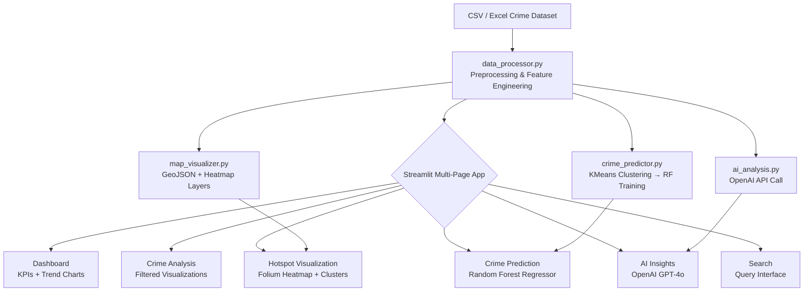

# 🚨 CrimeSpot — Crime Analysis & Prediction Platform

[](https://www.python.org/)
[](https://streamlit.io/)
[](https://scikit-learn.org/)
[](https://openai.com/)
[](https://plotly.com/)
[](https://python-visualization.github.io/folium/)
[](https://pandas.pydata.org/)
[](LICENSE)

> A full-stack, AI-augmented web application for geospatial crime data analysis, hotspot detection, and predictive policing — built for the **CyberHackathon** competition.

---

## 📌 Problem Statement / Objective

Law enforcement agencies face significant challenges in proactively allocating resources due to the reactive nature of traditional crime reporting systems. Manual analysis of large, multi-dimensional crime datasets is time-consuming and error-prone, leading to delayed responses and inefficient patrol deployment.

**CrimeSpot** addresses this by providing:
- Automated ingestion and preprocessing of historical crime records.
- Geospatial hotspot identification using clustering algorithms.
- Temporal crime trend forecasting using supervised ML models.
- Natural-language crime pattern interpretation via OpenAI GPT-4o.

The platform is designed to empower analysts, law enforcement officers, and policymakers with actionable intelligence derived from structured crime data.

---

## ✨ Features

- **Interactive Dashboard** — At-a-glance KPIs: total incidents, crime type distribution, and 12-month trend lines.
- **Crime Analysis Module** — Date-range and crime-type filters with multi-tab visualizations (by type, time-of-day, and location).
- **Geospatial Hotspot Visualization** — Interactive Folium/Leaflet maps with density heatmaps and cluster markers.
- **ML-Based Crime Prediction** — Random Forest Regressor trained on temporal + spatial features; forecasts crime counts for configurable future periods.
- **AI-Powered Insights (GPT-4o)** — Automated narrative analysis of crime patterns, anomaly detection, and strategic recommendations via the OpenAI API.
- **Crime Report Submission** — Citizen-facing form to log new incidents directly into the session dataset.
- **Advanced Search** — Filter and query the crime database by type, location, and time window.

---

## 🛠 Tech Stack

| Layer | Technology | Purpose |
|---|---|---|
| **Frontend / UI** | Streamlit 1.43+ | Multi-page interactive web application |
| **Data Processing** | Pandas 2.2+, NumPy 2.2+ | Data ingestion, cleaning, feature engineering |
| **Geospatial Mapping** | Folium 0.19+, streamlit-folium 0.24+ | Interactive Leaflet.js map rendering |
| **Visualization** | Plotly 6.0+ | Bar charts, line graphs, scatter plots |
| **Machine Learning** | scikit-learn 1.6+ | RandomForestRegressor, KMeans, DBSCAN, StandardScaler |
| **AI / NLP** | OpenAI GPT-4o (openai 1.68+) | Natural-language crime pattern analysis |
| **Data Formats** | openpyxl 3.1+ | Excel (.xlsx) dataset support |
| **Runtime** | Python 3.11+ | Core language |
| **Platform** | Replit (replit.nix) | Cloud-hosted development & deployment |
| **Package Management** | uv / pip | Dependency resolution |

---

## 🏗 System Architecture / Workflow



**Data Flow:**
1. Raw CSV is loaded and preprocessed (date parsing, null handling, coordinate validation).
2. Feature engineering extracts temporal signals: hour, day-of-week, month, location cluster.
3. KMeans clusters spatial data into zones; a Random Forest model is trained on these features.
4. Folium renders interactive heatmaps and marker clusters in the browser.
5. GPT-4o receives a structured data summary and returns narrative insights.

---

## ⚙️ Installation & Setup

### Prerequisites

- Python 3.11 or higher
- pip or [uv](https://github.com/astral-sh/uv) package manager
- An [OpenAI API key](https://platform.openai.com/api-keys) *(required for AI Insights module)*

### Quick Start

```bash
# 1. Clone the repository
git clone https://github.com/SBK-07/CrimeHotspots-CyberHackathon.git
cd CrimeHotspots-CyberHackathon

# 2. Create and activate a virtual environment
python -m venv venv
source venv/bin/activate        # Linux / macOS
# venv\Scripts\activate         # Windows

# 3. Install dependencies
pip install streamlit pandas numpy plotly folium streamlit-folium scikit-learn openpyxl openai
# OR using uv:
# uv sync

# 4. Set your OpenAI API key (required for AI Insights)
export OPENAI_API_KEY="sk-..."  # Linux / macOS
# set OPENAI_API_KEY=sk-...     # Windows CMD

# 5. Launch the application
streamlit run app.py
```

The app will be available at **`http://localhost:8501`** in your browser.

### Replit Deployment

The repository includes `.replit` and `replit.nix` configuration files for one-click deployment on [Replit](https://replit.com). Simply fork the Repl and set `OPENAI_API_KEY` in the Replit Secrets panel.

---

## 🚀 Usage

| Page | Description |
|---|---|
| **Dashboard** | Overview of total incidents, crime type breakdown, monthly trend, and crime report submission form. |
| **Crime Analysis** | Apply date-range and crime-type filters; explore tabbed views: by type, by time-of-day, by location. |
| **Hotspot Visualization** | Interactive map with heatmap overlay and cluster markers; zoom/pan to explore high-density areas. |
| **Crime Prediction** | Train the Random Forest model on loaded data, then generate future crime count forecasts per zone. |
| **AI Insights** | Enter your OpenAI API key (if not set via environment), then request automated narrative analysis and strategic recommendations. |
| **Search** | Query the dataset by crime type, location description, or date window. |

> **Note:** The platform auto-loads `attached_assets/Cuddalore_Crime_Database_Updated.csv` on startup. Replace this file with any compatible CSV to analyze different datasets.

---

## 📸 Screenshots / Demo

> *(Screenshots will be added once the live deployment is available. The presentation slides are available in `Title_page.pptx`.)*

| View | Description |
|---|---|
| Dashboard | KPI cards + Top-10 crime types bar chart + 12-month trend line |
| Hotspot Map | Folium heatmap rendered over Cuddalore district geography |
| Prediction | Forecast chart with per-zone crime count projections |
| AI Insights | GPT-4o narrative summary with policing recommendations |

---

## 🔌 API Integration

### OpenAI GPT-4o

| Parameter | Value |
|---|---|
| **Endpoint** | `https://api.openai.com/v1/chat/completions` |
| **Model** | `gpt-4o` |
| **Authentication** | Environment variable `OPENAI_API_KEY` |
| **Usage** | Crime pattern analysis, anomaly narrative, report generation |

The integration is implemented in `utils/ai_analysis.py`. Three functions are exposed:
- `analyze_crime_patterns(crime_data)` — Structural analysis of temporal/spatial patterns.
- `generate_crime_report(crime_data, period)` — Formatted summary report for a given time window.
- `analyze_specific_crime(crime_data, crime_type)` — Deep-dive into a single crime category.

---

## 📁 Folder Structure

```
CrimeHotspots-CyberHackathon/
├── app.py                          # Main Streamlit entry point; navigation & session state
├── pyproject.toml                  # Project metadata & dependency declarations (uv)
├── packages_needed.txt             # Human-readable pip install instructions
├── replit.nix                      # Nix environment config for Replit
├── .replit                         # Replit run configuration
├── .streamlit/                     # Streamlit theme / server config
├── pages/
│   ├── dashboard.py                # KPI dashboard page
│   ├── predictions.py              # ML prediction page
│   ├── ai_insights.py              # OpenAI-powered insights page
│   └── search.py                   # Crime search & query page
├── utils/
│   ├── __init__.py
│   ├── data_processor.py           # Data loading, preprocessing, feature engineering
│   ├── data_processing.py          # Additional data transformation utilities
│   ├── map_visualizer.py           # Folium map & heatmap construction
│   ├── map_visualization.py        # Extended map rendering helpers
│   ├── crime_predictor.py          # RandomForest + KMeans training & inference
│   ├── prediction.py               # Prediction helper utilities
│   ├── ai_analysis.py              # OpenAI API integration
│   ├── analysis.py                 # Statistical analysis functions
│   └── visualizer.py               # Plotly chart builders
├── assets/
│   └── map_data.py                 # Static map reference data
├── attached_assets/
│   └── Cuddalore_Crime_Database_Updated.csv   # Primary crime dataset
├── generated-icon.png              # Application icon
└── Title_page.pptx                 # Hackathon presentation slides
```

---

## 🔮 Future Enhancements / Roadmap

| Priority | Enhancement |
|---|---|
| 🔴 High | Real-time data ingestion via police department APIs or citizen-reporting webhooks |
| 🔴 High | User authentication & role-based access control (admin vs. analyst vs. citizen) |
| 🟡 Medium | Deep learning model (LSTM/Transformer) for temporal crime sequence forecasting |
| 🟡 Medium | Multi-city/multi-district dataset support with dynamic geographic switching |
| 🟡 Medium | Automated PDF/Excel report export from the AI Insights module |
| 🟢 Low | Mobile-responsive Progressive Web App (PWA) wrapper |
| 🟢 Low | Integration with national crime statistics APIs (NCRB India / UCR US) |
| 🟢 Low | Containerization via Docker + CI/CD pipeline (GitHub Actions) |

---

## 🤝 Contributing

Contributions are welcome. Please follow the standard GitHub workflow:

1. Fork the repository.
2. Create a feature branch: `git checkout -b feature/your-feature-name`.
3. Commit your changes with a clear message: `git commit -m "feat: describe your change"`.
4. Push to your fork: `git push origin feature/your-feature-name`.
5. Open a Pull Request against the `main` branch with a description of your changes.

Please ensure your code follows PEP 8 style guidelines and that any new modules include docstrings.

---

## 📄 License

No license file is currently specified in this repository. All rights reserved by the author unless otherwise stated. Contact the author before using, distributing, or modifying this project.

---

## 👤 Author / Contact

**SBK-07**

- GitHub: [@SBK-07](https://github.com/SBK-07)
- Project Link: [https://github.com/SBK-07/CrimeHotspots-CyberHackathon](https://github.com/SBK-07/CrimeHotspots-CyberHackathon)

> *This project was developed as part of a CyberHackathon competition, demonstrating applied AI/ML, full-stack development, and geospatial data engineering skills.*
